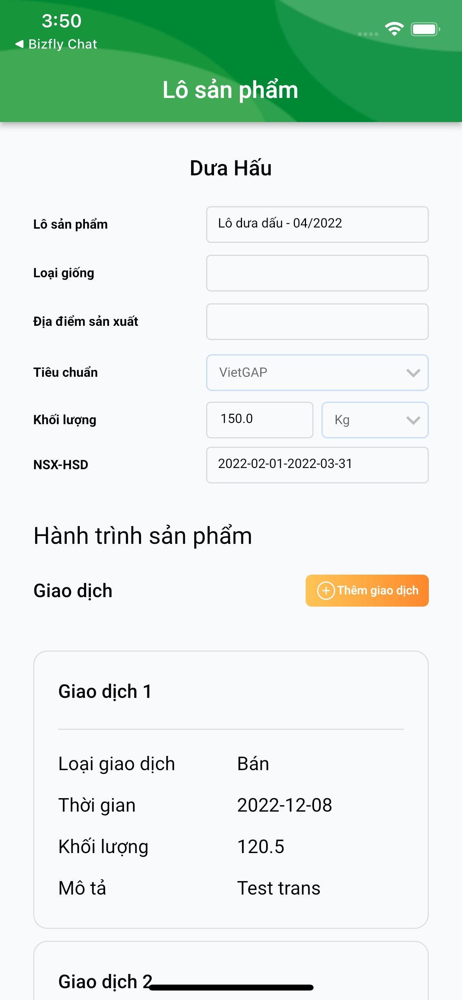
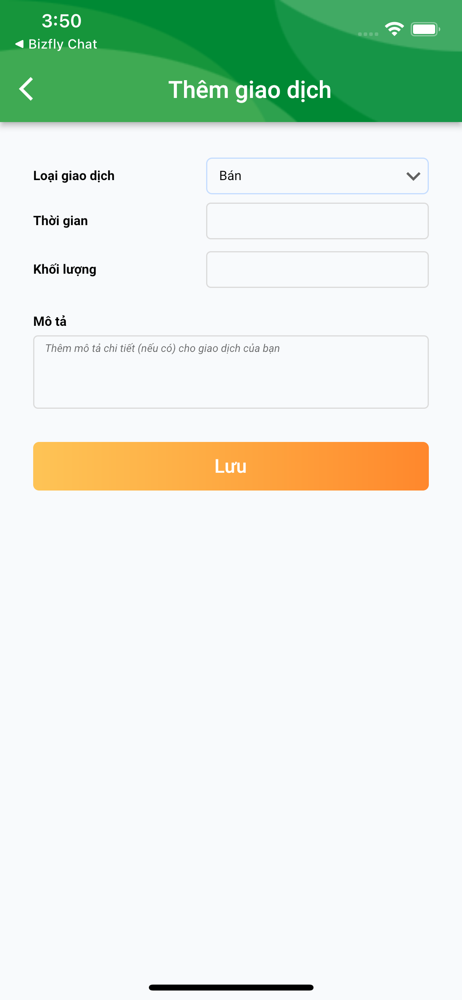

<!-- PROJECT LOGO -->
<br/>
<p>
    <a href="https://github.com/vinhtt95/getx_boilerplate">
        
    </a>

<h3>Flutter GetX Boilerplate</h3>
<p>
    boilerplate_description
    <br/>
    <a href="https://github.com/vinhtt95/getx_boilerplate"><strong>Explore the docs »</strong></a>
    <br/>
    <br/>
    <a href="https://apps.apple.com/today">App Store</a>
    ·
    <a href="https://play.google.com/store">Google Play</a>
</p>


<!-- TABLE OF CONTENTS -->
<details open="open">
    <summary>Mục lục</summary>
    <ol>
        <li>
            <a href="#giới-thiệu">Giới thiệu</a>
        </li>
        <li>
            <a href="#bắt-đầu"> Bắt đầu</a>
            <ul>
                <li><a href="#khởi-tạo-môi-trường">Khởi tạo môi trường</a></li>
                <li><a href="#khởi-tạo-dự-án">Khởi tạo dự án</a></li>
            </ul>
        </li>
        <li><a href="#tài-liệu-dự-án">Tài liệu dự án</a></li>
        <li><a href="#các-chức-năng">Các chức năng</a></li>
        <li><a href="#acknowledgements">Acknowledgements</a></li>
    </ol>
</details>

<!-- ABOUT THE PROJECT -->

# Giới thiệu

Khai báo thông tin lô sản xuất cho ứng dụng quản lý nông sản.
## 1. Lô sản xuất
```sh
curl --location --request GET 'https://rpc.freshdi.com/api/method/freshdi.data.test.batch.get_batch_detail' \
--form 'cultivation="FTWZV001080209TA"'
```
Hiển thị thông tin lô sản xuất bằng cách truy vấn thông tin qua API.

## 2. Thêm thông tin giao dịch
Người dùng tiến hành thêm thông tin giao dịch bao gồm: Loại giao dịch, Thời gian, Khối lượng, Mô tả.

## 3. Lưu thông tin
```sh
curl --location --request POST 'https://rpc.freshdi.com/api/method/freshdi.data.test.batch_trans.post_batch_trans' \
--header 'Content-Type: application/json' \
--data-raw '{
    "trans_cultivation": "FTWZV001080209TA",
    "trans_type": "Bán",
    "trans_date": "2022-12-08",
    "trans_quantity": 120.5,
    "trans_uom": "kg",
    "trans_description": "Test trans"
}'
```
Sau khi điền thông tin về giao dịch, tiến hành lưu thông tin thông qua giao dịch API.

## 4. Lô sản xuất_result
Sau khi hoàn tất việc thực hiện các thay đổi và lưu lại, người dùng sẽ có được một trang quản lý thông tin lô sản xuất trong ứng dụng. Hiển thị thông tin bằng các truy vấn API.
<!-- GETTING STARTED -->

# Bắt đầu

## Khởi tạo môi trường

* MacOS

* Home brew
  ```sh
  /bin/bash -c "$(curl -fsSL https://raw.githubusercontent.com/Homebrew/install/HEAD/install.sh)"
  ```
* Dart
  ```sh
  brew tap dart-lang/dart
  brew install dart
  ```

* Flutter
  ```sh
  brew install --cask flutter
  ```

* Cocoapods
  ```sh
  brew install cocoapods
  ```

## Khởi tạo dự án

1. Clone the repo
   ```sh
   git clone https://github.com/vinhtt95/getx_boilerplate.git
   ```
2. Cài đặt pub
   ```sh
   flutter pub get
   ```
# Tài liệu dự án

1. [SWR]()
2. [SRS]()
3. [SWD]()
4. [API Documentation]()
5. [Timeline]()

# Chức năng:

* Get Thông tin lô sản phẩm
  <br>
  
* Thêm thông tin giao dịch
  <br>
  

<!-- ACKNOWLEDGEMENTS -->

## Acknowledgements

* [Mastering Markdown](https://mermaid-js.github.io/mermaid/#/)
* [Best-README-Template](https://github.com/othneildrew/Best-README-Template#built-with)
